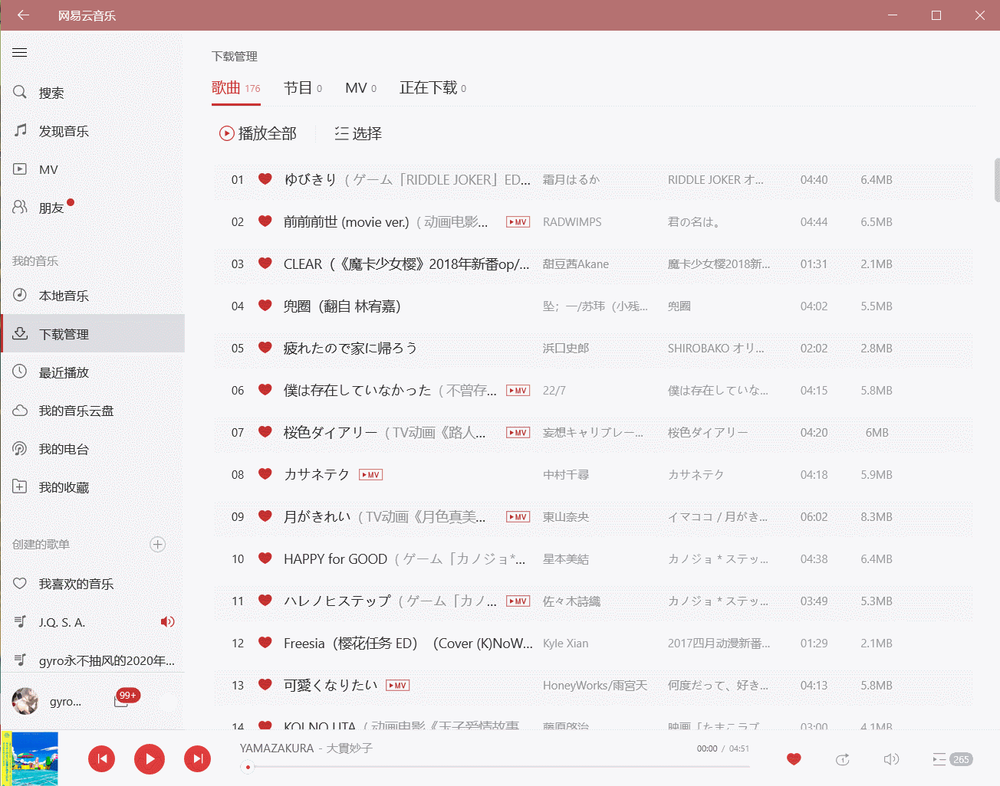

# Ayase

[简体中文 | For Simplified Chinese version, please click here](README_zh-cn.md)

Ayase is a tool which can help you to control everything by keyboard. This is specifically designed for ~~lazy people like me~~ and blind people. It is known to all that in the most cases, we have to control the computer by **both** mouse **and** keyboard. However, the frequent switch for our hand between mice and keyboards would severely threaten the health of our wrists. Meanwhile, for blind people, though in most cases, it is convenient enough to use the screen readers to control elements on screen, most softwares cannot control both precisely and **swiftly**. You have to wait for the element or switch many times to find the element you want to control. With Ayase, these problems are all solved.

# Screenshots

Use Ayase to control Netease Music UWP:



Use Ayase to surf on the Internet:


# About Naming (Ayase)

I love Mitsukasa Ayase forever!

https://zh.moegirl.org.cn/三司绫濑

# Features

- Support high DPI, different DPI across multiple monitors, cross monitor display
- Support Chrome-based Apps (e.g. Github Desktop)
- Support Electron Apps (e.g. Visual Studio Code)
- Support WinForms, WPF, UWP (e.g. Netease Music UWP)
- Support the self-developed UI frameworks (e.g. Wechat & QQ of Tencent Inc.)
- Scanning of UI tree with high speed
- Support **pinyin** for Chinese (e.g. 网易云 → wyy / wangyiyun)
- Ignore upper and lower case

For the discussion on accessibility development and speed optimization, please refer to my following articles. Finally, the implementation scheme I adopted is to use `C++` to invoke `Win32API / uiautomation.h` and compile into `dll` (dynamic link library). Then, I used `P/Invoke` in the `C# / WPF` project to use the library. In most cases, the performance was improved for about 80%.

- [.NET C# AutomationElement 获取桌面UI元素](https://gyrojeff.top/index.php/archives/NET-C-AutomationElement-%E8%8E%B7%E5%8F%96%E6%A1%8C%E9%9D%A2UI%E5%85%83%E7%B4%A0/)
- [.NET C# 手撕线程池 | 县城撕裂者](https://gyrojeff.top/index.php/archives/NET-C-%E6%89%8B%E6%92%95%E7%BA%BF%E7%A8%8B%E6%B1%A0-%E5%8E%BF%E5%9F%8E%E6%92%95%E8%A3%82%E8%80%85/)
- [.NET C# AutomationElement 加速探索](https://gyrojeff.top/index.php/archives/NET-C-AutomationElement-%E5%8A%A0%E9%80%9F%E6%8E%A2%E7%B4%A2/)
- [.NET C# UIAutomationElement 获取桌面元素](https://gyrojeff.top/index.php/archives/NET-C-UIAutomationElement-%E8%8E%B7%E5%8F%96%E6%A1%8C%E9%9D%A2%E5%85%83%E7%B4%A0/)
- [.NET C# 通过Win32API获取窗口及控件的信息](https://gyrojeff.top/index.php/archives/NET-C-%E9%80%9A%E8%BF%87Win32API%E8%8E%B7%E5%8F%96%E7%AA%97%E5%8F%A3%E5%8F%8A%E6%8E%A7%E4%BB%B6%E7%9A%84%E4%BF%A1%E6%81%AF/)
- [.NET C# 获取桌面UI元素总结](https://gyrojeff.top/index.php/archives/NET-C-%E8%8E%B7%E5%8F%96%E6%A1%8C%E9%9D%A2UI%E5%85%83%E7%B4%A0%E6%80%BB%E7%BB%93/)
- [.NET C# MSAA 获取桌面UI元素](https://gyrojeff.top/index.php/archives/NET-C-MSAA-%E8%8E%B7%E5%8F%96%E6%A1%8C%E9%9D%A2UI%E5%85%83%E7%B4%A0/)
- [.NET C# C++ 混编问题](https://gyrojeff.top/index.php/archives/NET-C-C-%E6%B7%B7%E7%BC%96%E9%97%AE%E9%A2%98/)

Note that I do not have additional time and effort to translate those articles into English. Using translators can also understand the articles well. If you still have any questions or advice, you can contact me directly. You can find ways to contact me in my GitHub homepage. This is the first time I write `WPF / C#` this formally, so if you have any advice, please don't hesitate to raise issues or pull requests.

# Project Structure

```
.
├── Ayase                                   # Ayase Project
│   ├── AccessibilityBridge                 # P/Invoke bridge for .dll
│   │   ├── GNativeIUIAutomationManager.cs
│   │   └── GNativeUIElement.cs
│   ├── App.xaml
│   ├── App.xaml.cs                         # Entrance
│   ├── AssemblyInfo.cs
│   ├── AutomationLib                       # Most of them are no longer used. Serve as alternatives
│   │   ├── GAutomationManager.cs
│   │   ├── GIUIAutomationManager.cs
│   │   ├── GMSAAManager.cs
│   │   ├── GRawUIManager.cs
│   │   ├── GUIElement.cs
│   │   └── Wrapper                         # Wrapper for Win32API used in this section
│   │       ├── ObjectIdentifiers.cs
│   │       ├── RECT.cs
│   │       ├── ReferenceIdentifiers.cs
│   │       └── Win32API.cs
│   ├── Ayase.csproj
│   ├── Ayase.csproj.user
│   ├── HotkeyLib                           # Global hotkey wrapping
│   │   ├── GHotKey.cs
│   │   ├── GKeybdEvent.cs
│   │   └── VirtualKeys.cs
│   ├── MouseLib                            # Mouse control wrapping
│   │   └── GMouse.cs
│   ├── Properties
│   │   └── launchSettings.json
│   ├── ScreenLib                           # Screen library wrapping
│   │   └── PrimaryScreen.cs
│   ├── ThreadLib                           # Private thread pool
│   │   └── GThreadPool.cs
│   └── UI                                  # UI
│       ├── FormMaskWindow.xaml
│       ├── FormMaskWindow.xaml.cs
│       ├── MaskWindow.cs
│       ├── NotationLabel.cs
│       ├── ReuseWindow.cs
│       ├── ScreenMaskWindow.xaml
│       ├── ScreenMaskWindow.xaml.cs
│       ├── SearchWindow.xaml
│       ├── SearchWindow.xaml.cs
│       ├── SettingsWindow.xaml
│       ├── SettingsWindow.xaml.cs
│       └── WindowManager.cs                # Windows scheduling
├── Ayase.Accessibility                     # dll project
│   ├── Ayase.Accessibility.vcxproj
│   ├── Ayase.Accessibility.vcxproj.filters
│   ├── Ayase.Accessibility.vcxproj.user
│   ├── GConstant.h                         # Some constants
│   ├── GIUIAutomationManager.cpp           # Main implementation
│   ├── GIUIAutomationManager.h
│   ├── GUIElement.cpp                      # Wrapping for data structure
│   ├── GUIElement.h
│   ├── dllmain.cpp
│   ├── framework.h
│   ├── pch.cpp
│   └── pch.h
└── Ayase.sln
```

The TOC for generated project:

```
.
├── ...
├── Ayase.Accessibility.dll
└── <.net target>
    ├── ...
    └── Ayase.exe
```

# Dependencies

- `Microsoft.Toolkit.Uwp.Notifications`
- `Notifications.Wpf`
- `ToolGood.Words`

# Usage

- Start UI Scanning: `Alt + CapLocks` (We would adjust the status of `CapLocks` automatically)
- Exit UI Scanning: `Esc`
- Next Element: `Tab`
- Previous Element: `Shift + Tab`
- Click the Selected Element: `Enter`
- Move the mouse to the Selected Element: `Shift + Enter`

# TODO

- Add voice module
- Add settings module
- Add support for control by `AWSD`
- Add pure mouse mode
