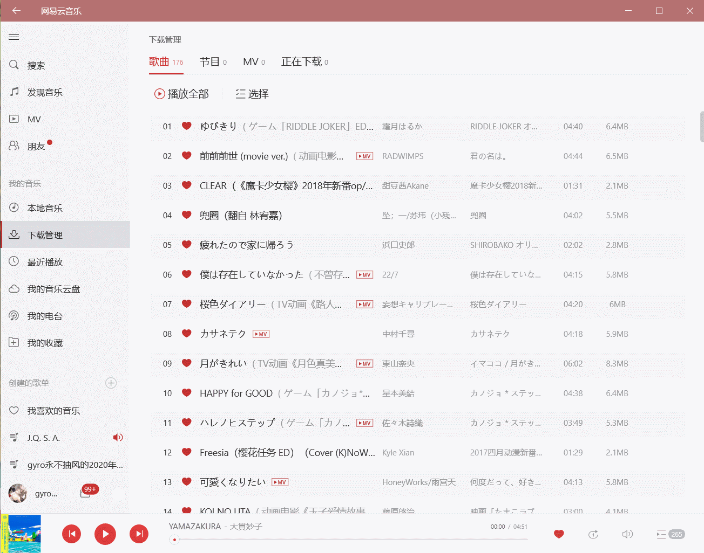

# Ayase

Ayase是一款旨在使用键盘对电脑进行控制的软件。其专门为~~像我这样的懒人~~, 盲人打造。众所周知，在普通情况下，我们需要同时使用键盘**和**鼠标对电脑进行控制，然而频繁的键盘与鼠标间的切换回让人身心俱疲，同时使得手腕关节持续疲劳，有害于人的身体健康。同时，对于盲人朋友们，使用屏幕阅读器固然可以很好地使用电脑，然而大多数情况下其却不能“指哪打哪”，即不能对目标控件进行即刻控制，大多情况下需要等待或快进到需要控制的元素，而Ayase可以通过搜索的方式精确定位，快速控制。

# 截图

使用Ayase操作网易云音乐UWP：



使用Ayase网上冲浪：


# 关于命名

我永远喜欢三司~~零奶~~（绫濑）

https://zh.moegirl.org.cn/三司绫濑

# Features

- 支持高DPI，多显示器不同DPI，跨屏幕显示
- 支持Chrome-based Apps (e.g. Github Desktop)
- 支持Electron Apps (e.g. Visual Studio Code)
- 支持WinForms, WPF, UWP (e.g. 网易云UWP)
- 支持腾讯等多家公司的自研UI框架 (e.g. 腾讯的微信、QQ)
- 页面元素高速读取
- 支持拼音、拼音首字母搜索 (e.g. 网易云 → wyy / wangyiyun)
- 忽略大小写

关于Accessibility方面的开发以及速度优化的讨论，可以看我下面的几篇文章。最终我采用的实现方案是`C++`调用`Win32API / uiautomation.h`编译成`dll`动态链接库，在`C# / WPF`项目中通过`P/Invoke`进行调用。在大多数情况下，速度同比提升将近80%.

- [.NET C# AutomationElement 获取桌面UI元素](https://gyrojeff.top/index.php/archives/NET-C-AutomationElement-%E8%8E%B7%E5%8F%96%E6%A1%8C%E9%9D%A2UI%E5%85%83%E7%B4%A0/)
- [.NET C# 手撕线程池 | 县城撕裂者](https://gyrojeff.top/index.php/archives/NET-C-%E6%89%8B%E6%92%95%E7%BA%BF%E7%A8%8B%E6%B1%A0-%E5%8E%BF%E5%9F%8E%E6%92%95%E8%A3%82%E8%80%85/)
- [.NET C# AutomationElement 加速探索](https://gyrojeff.top/index.php/archives/NET-C-AutomationElement-%E5%8A%A0%E9%80%9F%E6%8E%A2%E7%B4%A2/)
- [.NET C# UIAutomationElement 获取桌面元素](https://gyrojeff.top/index.php/archives/NET-C-UIAutomationElement-%E8%8E%B7%E5%8F%96%E6%A1%8C%E9%9D%A2%E5%85%83%E7%B4%A0/)
- [.NET C# 通过Win32API获取窗口及控件的信息](https://gyrojeff.top/index.php/archives/NET-C-%E9%80%9A%E8%BF%87Win32API%E8%8E%B7%E5%8F%96%E7%AA%97%E5%8F%A3%E5%8F%8A%E6%8E%A7%E4%BB%B6%E7%9A%84%E4%BF%A1%E6%81%AF/)
- [.NET C# 获取桌面UI元素总结](https://gyrojeff.top/index.php/archives/NET-C-%E8%8E%B7%E5%8F%96%E6%A1%8C%E9%9D%A2UI%E5%85%83%E7%B4%A0%E6%80%BB%E7%BB%93/)
- [.NET C# MSAA 获取桌面UI元素](https://gyrojeff.top/index.php/archives/NET-C-MSAA-%E8%8E%B7%E5%8F%96%E6%A1%8C%E9%9D%A2UI%E5%85%83%E7%B4%A0/)
- [.NET C# C++ 混编问题](https://gyrojeff.top/index.php/archives/NET-C-C-%E6%B7%B7%E7%BC%96%E9%97%AE%E9%A2%98/)

这是我第一次正儿八经地写`WPF / C++`，所以如果有什么问题还请大家多提`PR / Issues`

# 关于项目结构

```
.
├── Ayase                                   # Ayase Project
│   ├── AccessibilityBridge                 # P/Invoke bridge for .dll
│   │   ├── GNativeIUIAutomationManager.cs
│   │   └── GNativeUIElement.cs
│   ├── App.xaml
│   ├── App.xaml.cs                         # Entrance
│   ├── AssemblyInfo.cs
│   ├── AutomationLib                       # 大部分已经不用了，是替代方案
│   │   ├── GAutomationManager.cs
│   │   ├── GIUIAutomationManager.cs
│   │   ├── GMSAAManager.cs
│   │   ├── GRawUIManager.cs
│   │   ├── GUIElement.cs
│   │   └── Wrapper                         # 用到的Win32API的封装
│   │       ├── ObjectIdentifiers.cs
│   │       ├── RECT.cs
│   │       ├── ReferenceIdentifiers.cs
│   │       └── Win32API.cs
│   ├── Ayase.csproj
│   ├── Ayase.csproj.user
│   ├── HotkeyLib                           # 全局热键封装
│   │   ├── GHotKey.cs
│   │   ├── GKeybdEvent.cs
│   │   └── VirtualKeys.cs
│   ├── MouseLib                            # 鼠标控制封装
│   │   └── GMouse.cs
│   ├── Properties
│   │   └── launchSettings.json
│   ├── ScreenLib                           # 屏幕信息封装
│   │   └── PrimaryScreen.cs
│   ├── ThreadLib                           # 私有线程池实现
│   │   └── GThreadPool.cs
│   └── UI                                  # UI
│       ├── FormMaskWindow.xaml
│       ├── FormMaskWindow.xaml.cs
│       ├── MaskWindow.cs
│       ├── NotationLabel.cs
│       ├── ReuseWindow.cs
│       ├── ScreenMaskWindow.xaml
│       ├── ScreenMaskWindow.xaml.cs
│       ├── SearchWindow.xaml
│       ├── SearchWindow.xaml.cs
│       ├── SettingsWindow.xaml
│       ├── SettingsWindow.xaml.cs
│       └── WindowManager.cs                # 窗口管理调度
├── Ayase.Accessibility                     # dll project
│   ├── Ayase.Accessibility.vcxproj
│   ├── Ayase.Accessibility.vcxproj.filters
│   ├── Ayase.Accessibility.vcxproj.user
│   ├── GConstant.h                         # 定义的一些常数
│   ├── GIUIAutomationManager.cpp           # 主要实现
│   ├── GIUIAutomationManager.h
│   ├── GUIElement.cpp                      # 数据结构封装
│   ├── GUIElement.h
│   ├── dllmain.cpp
│   ├── framework.h
│   ├── pch.cpp
│   └── pch.h
└── Ayase.sln
```

生成目录结构：

```
.
├── ...
├── Ayase.Accessibility.dll
└── <.net target>
    ├── ...
    └── Ayase.exe
```

# Dependencies

- `Microsoft.Toolkit.Uwp.Notifications`
- `Notifications.Wpf`
- `ToolGood.Words`

# 使用方法

- 开始UI识别：`Alt + CapLocks` (我们会自动还原`CapLocks`状态)
- 退出识别：`Esc`
- 下一个元素：`Tab`
- 上一个元素：`Shift + Tab`
- 鼠标点击当前选中的UI元素：`Enter`
- 鼠标移动到当前选中的UI元素：`Shift + Enter`

# TODO

- 增加语音模块
- 增加设置功能
- 使用`AWSD`进行方向操作
- 纯控制鼠标模式
